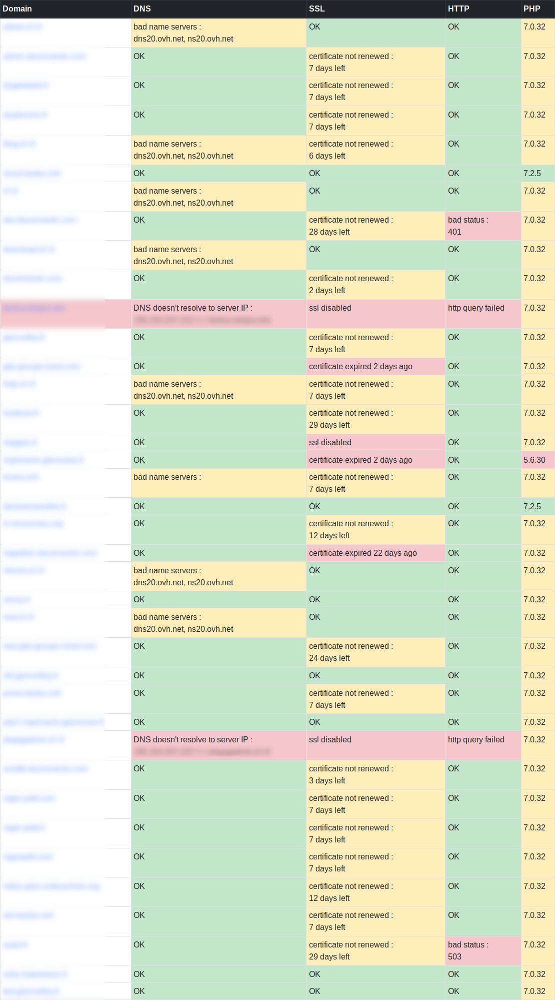

# IspAdmin
IspConfig additionnal admin features  
  
- websites check  
    - WhoIs (nameservers correspond to config, for IspConfig DNS feature use)  
    - DNS (resolved address correspond to webstite's server's address configured  
    - SSL (certificate is still valid, comes from let's encrypt)  
    - HTTP (website's home page respond with a valid status)  
    - PHP (version choosen is still supported)  
  


- E-mails
	- mailbox bolk creation
	
- DNS
	- list all DNS entries, with filtering options
	- multi-entry select
	- bulk change name / data of selected entries
  
## requirements
- PHP 8.x (8.3 compatible)
	- php-intl
- create an IspConfig remote user in the panel : "System > Remote users"  
  
## installation
```
git clone https://github.com/olaulau/IspAdmin
cd IspAdmin
composer install

cd conf
cp 	tech.dist.ini tech.ini
vim tech.ini ## fill in values
cd ..

crontab -e
	php index.php ssl_auto_renew
```
